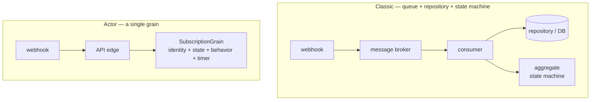

# One workflow, two architectures: what porting a phone number taught me about actors vs. queues

*An introduction to a series that rebuilds a telco-style subscription backend on [Microsoft Orleans](https://github.com/dotnet/orleans). Code in the [TelcoLab](https://github.com/aminch18/TelcoLab) repo.*

---

I picked one small, real workflow — porting a mobile number between operators — and built it two ways: the **classic** way (a message queue, a consumer, a repository, and an aggregate with a state machine) and the **actor** way (a single Orleans grain). This post is not "actors win." It's what the comparison actually taught me: where each shines, where each hurts, and why this particular workflow is a great thing to *learn* from and a poor thing to *migrate*.

## The workflow, in one breath

You ask to keep your number when switching operators. Your new operator sends the request to a central clearing house, which coordinates with your old operator. Then you wait — seconds, hours, sometimes days — until an answer comes back as a webhook: **completed** or **rejected**. So the workflow is asynchronous, involves a third party you don't control, and is eventually consistent: between "requested" and "resolved" the subscription sits in a real, durable limbo. Every serious system has workflows shaped exactly like this.

## The two architectures at a glance



**Classic.** A broker delivers the porting event. A consumer loads the subscription by its correlation key, checks whether the transition is allowed, applies it, and saves:

```csharp
var subscription = await repository.GetByMsisdnAsync(msg.Msisdn, ct);
if (subscription is null) return HandleResult.Drop;
if (subscription.Status != SubscriptionStatus.Porting) return HandleResult.Ack; // skip-guard

subscription.ApplyPortingResult(msg.ToDomain());   // the aggregate's state machine
await repository.SaveAsync(subscription, ct);       // Upsert, with optimistic concurrency
```

**Actor.** The webhook routes straight to a grain identified by the phone number. The same guard, but the state and behavior are the object:

```csharp
if (state.Status != SubscriptionStatus.Porting) return;            // same skip-guard
if (result.RequestId != state.PendingPortingRequestId) return;     // correlation guard
state.Status = result.Succeeded ? Active : PortingRejected;
await state.WriteStateAsync();
```

Same logic. The interesting part is everything *around* that logic.

## What I actually learned

### 1. The concurrency win is the real one

The classic version forces a choice you might not notice you're making. Run **one consumer** per queue and you're safe — everything is serialized — but you've also serialized unrelated subscriptions against each other, and you've capped throughput. Scale to **many consumers** and now two events for the *same* subscription can be processed at once: a `completed` and a `rejected` racing, or a retry racing a fresh event. To stay correct you reach for optimistic concurrency and retry-on-conflict, scattered across every handler that mutates a subscription.

The grain dissolves the dilemma. It is single-threaded *per key*: two operations on the same subscription never interleave, while different subscriptions run fully in parallel. You get per-entity safety and cross-entity parallelism at the same time, and you delete the retry-on-conflict code. Optimistic concurrency doesn't vanish entirely — it survives as an ETag backstop in storage for rare split-brain during failover — but it moves from something you code defensively everywhere to something the runtime handles at the edges.

That was the moment the actor model clicked for me: not "it's faster," but "a whole category of concurrency bugs becomes structurally impossible."

### 2. The lifecycle stops being smeared

In the classic version, a subscription's life is spread across many consumers (activate, porting-rejected, cancelled, suspended…), the repository, the aggregate, and a separate scheduler for timeouts. To answer "what is the full lifecycle?" you read N files. In the grain, every transition — and the timeout — lives on one class you can unit-test in one shot. That's cohesion, not new capability. But cohesion is what makes a workflow *correct*, because you can see it.

### 3. Timeouts come built in

"What if the webhook never arrives?" In the classic world you add a scheduler (delayed messages, Hangfire, cron). In the grain you register a **reminder** — a durable, cluster-wide timer that survives restarts — and it retries or times the port out from inside the same object. One less piece of infrastructure.

### 4. What does *not* change (this surprised me most)

The third party doesn't disappear — you still call the clearing house and still receive its webhooks. The **state machine doesn't disappear** — you still write the states and guards yourself; Orleans gives it a home, not the logic. The eventual consistency doesn't disappear. Actors are not a different *model of the problem*; they're a different *place to run it*.

## So when is each actually better?

**Reach for the classic queue + repository approach when:**
- you need visible in-flight work — queue depth, dead-letter, replay, drain;
- you're integrating many services and want the broker's decoupling;
- you already run a broker and a database, and adding a second stateful runtime is a cost, not a saving;
- the work is set-based or batch (bill every account, run a report).

**Reach for the actor model when:**
- the *entity* is the natural unit of concurrency, and there's contention on the same one;
- you have many small, individually-addressable, mostly-idle stateful things (devices, sessions, carts);
- state is hot and touched often, so keeping it in memory matters;
- you're greenfield and "this entity is an actor" is your central abstraction.

## Where porting itself lands

Honestly? A **draw that leans classic** if you already own the bus. Porting has cold state touched a few times over days, so the in-memory advantage is marginal; and a real telco backend is usually already event-driven across contexts, so the actor model would be a second runtime bolted on rather than the core.

And that is exactly why it's the perfect thing to learn from. It's small enough to hold in your head, it exercises every hard part — async, a third party, durable intermediate state, timeouts, out-of-order delivery — and it makes the trade-offs *concrete* instead of abstract. The lesson isn't "use Orleans for porting." It's that the actor model turns per-entity concurrency correctness from careful defensive work into a structural guarantee — and that's worth reaching for when the entity, not the message, is the thing you're really coordinating.

## Next

The next post builds the Orleans version in full — the grain, the simulated clearing house, the webhook, the correlation and timeout — and you can run it: [Part 1 — Why a porting workflow fits virtual actors](01-porting-with-orleans.en.md). All the code, including a `demo.sh` that drives the whole flow, is in the [TelcoLab repo](https://github.com/aminch18/TelcoLab).
