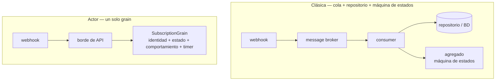

# Un flujo, dos arquitecturas: lo que portar un número de teléfono me enseñó sobre actores vs. colas

*Introducción a una serie que reconstruye un backend de suscripciones tipo telco sobre [Microsoft Orleans](https://github.com/dotnet/orleans). Código en el repo [TelcoLab](https://github.com/aminch18/TelcoLab).*

---

Cogí un flujo pequeño y real — portar un número móvil entre operadores — y lo construí de dos formas: la **clásica** (una cola de mensajes, un consumer, un repositorio y un agregado con máquina de estados) y la de **actores** (un único grain de Orleans). Este artículo no es "los actores ganan". Es lo que la comparación me enseñó de verdad: dónde brilla cada uno, dónde duele cada uno, y por qué este flujo concreto es estupendo para *aprender* y malo para *migrar*.

## El flujo, en una frase

Pides conservar tu número al cambiar de operador. Tu nuevo operador manda la petición a una entidad de clearing central, que coordina con tu operador antiguo. Y esperas — segundos, horas, a veces días — hasta que llega una respuesta como webhook: **completado** o **rechazado**. Así que el flujo es asíncrono, involucra a un tercero que no controlas, y es eventualmente consistente: entre "solicitado" y "resuelto" la suscripción queda en un limbo real y durable. Todo sistema serio tiene flujos con exactamente esta forma.

## Las dos arquitecturas de un vistazo



**Clásica.** Un broker entrega el evento de portabilidad. Un consumer carga la suscripción por su clave de correlación, comprueba si la transición está permitida, la aplica y guarda:

```csharp
var subscription = await repository.GetByMsisdnAsync(msg.Msisdn, ct);
if (subscription is null) return HandleResult.Drop;
if (subscription.Status != SubscriptionStatus.Porting) return HandleResult.Ack; // guarda de skip

subscription.ApplyPortingResult(msg.ToDomain());   // la máquina de estados del agregado
await repository.SaveAsync(subscription, ct);       // Upsert, con concurrencia optimista
```

**Actor.** El webhook enruta directo a un grain identificado por el número. La misma guarda, pero el estado y el comportamiento *son* el objeto:

```csharp
if (state.Status != SubscriptionStatus.Porting) return;            // la misma guarda de skip
if (result.RequestId != state.PendingPortingRequestId) return;     // guarda de correlación
state.Status = result.Succeeded ? Active : PortingRejected;
await state.WriteStateAsync();
```

La misma lógica. Lo interesante es todo lo que rodea a esa lógica.

## Lo que aprendí de verdad

### 1. La ganancia de concurrencia es la de verdad

La versión clásica te fuerza a una decisión que quizá no notas que estás tomando. Corre **un consumer** por cola y estás seguro — todo serializado — pero también has serializado suscripciones que no tienen nada que ver entre sí, y has topado el throughput. Escala a **varios consumers** y ahora dos eventos de la *misma* suscripción pueden procesarse a la vez: un `completed` y un `rejected` compitiendo, o un reintento contra un evento nuevo. Para seguir siendo correcto tiras de concurrencia optimista y retry-on-conflict, esparcidos por cada handler que muta una suscripción.

El grain disuelve el dilema. Es de un solo hilo *por clave*: dos operaciones sobre la misma suscripción nunca se entrelazan, mientras que suscripciones distintas corren totalmente en paralelo. Obtienes seguridad por-entidad y paralelismo entre entidades a la vez, y borras el código de retry-on-conflict. La concurrencia optimista no se evapora del todo — sobrevive como red de seguridad de ETag en el almacenamiento para el raro split-brain durante un failover — pero pasa de ser algo que codificas defensivamente por todas partes a algo que el runtime maneja en los bordes.

Ese fue el momento en que el modelo de actores me hizo clic: no "es más rápido", sino "una categoría entera de bugs de concurrencia se vuelve estructuralmente imposible".

### 2. El ciclo de vida deja de estar embarrado

En la versión clásica, la vida de una suscripción está repartida entre muchos consumers (activar, porting-rejected, cancelada, suspendida…), el repositorio, el agregado y un scheduler aparte para timeouts. Para responder "¿cuál es el ciclo de vida completo?" lees N ficheros. En el grain, cada transición — y el timeout — vive en una clase que testeas de un tiro. Es cohesión, no capacidad nueva. Pero la cohesión es lo que hace que un flujo sea *correcto*, porque puedes verlo.

### 3. Los timeouts vienen de serie

"¿Y si el webhook no llega nunca?" En el mundo clásico añades un scheduler (mensajes retardados, Hangfire, cron). En el grain registras un **reminder** — un timer durable y a nivel de clúster que sobrevive a reinicios — y reintenta o hace timeout del port desde dentro del mismo objeto. Una pieza menos de infraestructura.

### 4. Lo que *no* cambia (esto es lo que más me sorprendió)

El tercero no desaparece — sigues llamando al clearing house y sigues recibiendo sus webhooks. La **máquina de estados no desaparece** — sigues escribiendo tú los estados y las guardas; Orleans le da un hogar, no la lógica. La consistencia eventual no desaparece. Los actores no son un *modelo distinto del problema*; son un *sitio distinto donde ejecutarlo*.

## Entonces, ¿cuándo es mejor cada uno?

**Tira de la clásica (cola + repositorio) cuando:**
- necesitas ver el trabajo en vuelo — profundidad de cola, dead-letter, replay, drain;
- integras muchos servicios y quieres el desacoplamiento del broker;
- ya corres un broker y una base de datos, y añadir un segundo runtime stateful es un coste, no un ahorro;
- el trabajo es set-based o batch (facturar todas las cuentas, sacar un informe).

**Tira del modelo de actores cuando:**
- la *entidad* es la unidad natural de concurrencia, y hay contención sobre la misma;
- tienes muchas cosas stateful pequeñas, direccionables individualmente y mayormente inactivas (dispositivos, sesiones, carritos);
- el estado está caliente y se toca a menudo, así que tenerlo en memoria importa;
- es greenfield y "esta entidad es un actor" es tu abstracción central.

## Dónde cae el porting

¿Honestamente? Un **empate que se inclina a la clásica** si ya tienes el bus. El porting tiene estado frío que se toca unas pocas veces en días, así que la ventaja de tenerlo en memoria es marginal; y un backend telco real ya suele ser event-driven entre contextos, así que el modelo de actores sería un segundo runtime atornillado en vez del núcleo.

Y por eso es justo lo perfecto para aprender. Es lo bastante pequeño para tenerlo en la cabeza, ejercita cada parte difícil — async, un tercero, estado intermedio durable, timeouts, entregas desordenadas — y hace los trade-offs *concretos* en vez de abstractos. La lección no es "usa Orleans para porting". Es que el modelo de actores convierte la corrección de concurrencia por-entidad de trabajo defensivo cuidadoso en una garantía estructural — y eso vale la pena cuando la entidad, no el mensaje, es lo que realmente estás coordinando.

## Siguiente

El próximo artículo construye la versión de Orleans completa — el grain, el clearing house simulado, el webhook, la correlación y el timeout — y puedes ejecutarla: [Parte 1 — Por qué un flujo de portabilidad encaja con los actores virtuales](01-porting-with-orleans.es.md). Todo el código, incluido un `demo.sh` que dirige el flujo entero, está en el [repo TelcoLab](https://github.com/aminch18/TelcoLab).
