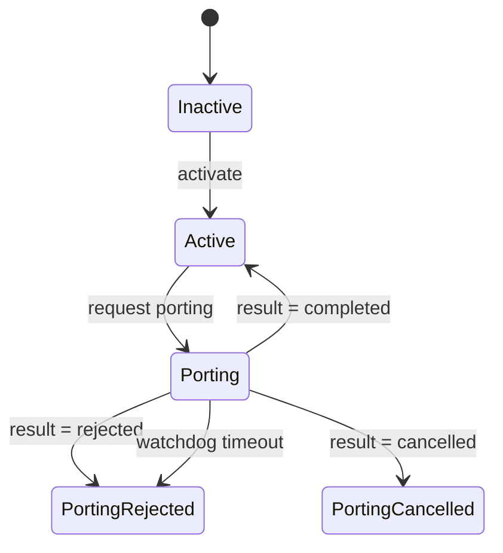
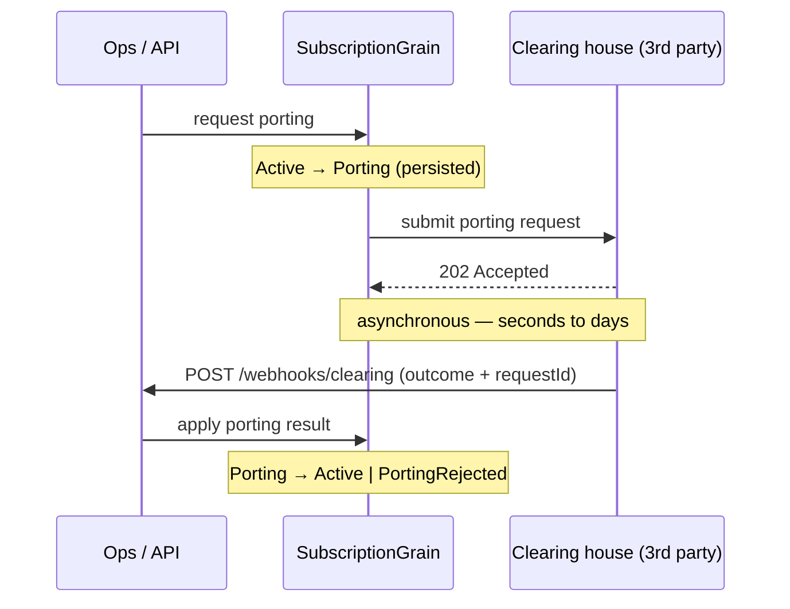

# Part 1 — Building the number-porting workflow with Orleans grains

*Part 1 of a series rebuilding a telco-style subscription backend on [Microsoft Orleans](https://github.com/dotnet/orleans). Start with the [introduction](00-porting-two-architectures.en.md), which compares this against the classic queue + repository approach and weighs when each wins. This post builds the Orleans version end to end — and you can run it. Code in the [TelcoLab](https://github.com/aminch18/TelcoLab) repo.*

---

In the introduction we put two architectures side by side and found the honest verdict: for number porting the actor model buys you per-entity concurrency correctness and a cohesive lifecycle, not a migration mandate. Now let's actually build it — the grain, the third party, the webhook, and the parts that make it correct rather than just a demo: request/result correlation and a timeout.

A quick recap of the workflow: you ask to keep your number, your operator forwards the request to a clearing house, and the outcome — **completed** or **rejected** — comes back as a webhook seconds to days later. Asynchronous, third-party, eventually consistent.

## What a grain is

A subscription has a stable identity (its MSISDN), owns a piece of state, and reacts to events over time — the definition of an actor. Orleans gives you **virtual actors**, called *grains*. A grain:

- is addressed by a key you choose (here, the phone number),
- is single-threaded — no locks, ever, inside a grain,
- is *virtual*: it always "exists"; Orleans activates it on demand and persists its state for you,
- lives in a **cluster of silos**, so grains are distributed across machines without you sharding anything.

The row + queue + worker + scheduler quartet of the classic design collapses into one object that has identity, state, and behavior together.

## The grain

The grain's contract is its lifecycle, keyed by the phone number:

```csharp
public interface ISubscriptionGrain : IGrainWithStringKey
{
    Task<SubscriptionState> GetStateAsync();
    Task ActivateAsync();

    // Active -> Porting. Submits the request; the result arrives later.
    Task RequestPortingAsync(string donorOperator);

    // Porting -> Active | PortingRejected | PortingCancelled, once the clearing house replies.
    Task ApplyPortingResultAsync(PortingResult result);
}
```

The whole lifecycle it drives is small enough to see at a glance:



The state is a plain record that Orleans serializes and persists:

```csharp
[GenerateSerializer]
public record SubscriptionState
{
    [Id(0)] public SubscriptionStatus Status { get; set; } = SubscriptionStatus.Inactive;
    [Id(1)] public string? DonorOperator { get; set; }
    [Id(2)] public PortingRejectionReason? LastRejectionReason { get; set; }
    // The request currently in flight, used to correlate the webhook that resolves it.
    [Id(3)] public Guid? PendingPortingRequestId { get; set; }
    [Id(4)] public int PortingAttempts { get; set; }
}
```

## Requesting a port

Requesting a port is a guarded transition. Note there is no lock — the grain is single-threaded by construction — and we persist the intent to port *before* talking to the third party:

```csharp
public async Task RequestPortingAsync(string donorOperator)
{
    if (state.State.Status != SubscriptionStatus.Active)
        throw new InvalidOperationException($"Cannot start porting from {state.State.Status}");

    var requestId = Guid.NewGuid();
    state.State.Status = SubscriptionStatus.Porting;
    state.State.DonorOperator = donorOperator;
    state.State.PendingPortingRequestId = requestId;
    state.State.PortingAttempts = 1;
    await state.WriteStateAsync();                        // durable intent, first

    await this.RegisterOrUpdateReminder("porting-watchdog",
        dueTime: TimeSpan.FromMinutes(1), period: TimeSpan.FromMinutes(1));
    await TrySubmitAsync(requestId, donorOperator);       // failure is tolerated; the watchdog retries
}
```

The subscription is now durably `Porting`. Crucially, **we did not wait** for the outcome. We recorded the intent, armed a safety net, handed the request to the third party, and returned.

## The third party, and the asynchronous hole

Real porting outcomes come back as a webhook, so in TelcoLab the third party is a separate service — a simulated **clearing house** — that answers `202 Accepted` immediately and then, after a delay, calls *us* back:

```csharp
// Clearing house: accept now, deliver the outcome later.
app.MapPost("/v1/porting-requests", (PortingRequest request, CallbackScheduler scheduler) =>
{
    var outcome = /* decide: completed, or rejected */;
    scheduler.ScheduleCallback(request.CallbackUrl, /* PortingResultEvent */);
    return Results.Accepted();
});
```

That delay is the whole point. It represents the donor operator and the national clearing house doing their thing. Our subscription stays in `Porting` the entire time — consistently, durably, and without a single thread parked waiting.

The full round trip, end to end:



## Closing the loop: webhook, anti-corruption, and two guards

When the outcome finally arrives, our API edge receives it, authenticates the caller, and routes it straight to the right grain by MSISDN. Before it touches the grain, we translate the third party's wire contract into *our* domain vocabulary — a small [anti-corruption layer](https://learn.microsoft.com/azure/architecture/patterns/anti-corruption-layer). Each endpoint is a self-contained record — one vertical slice — that [MinApiLib](https://github.com/fernandoescolar/MinApiLib) discovers automatically:

```csharp
public record ClearingWebhook() : Post("/webhooks/clearing")
{
    public async Task<IResult> HandleAsync(
        PortingResultEvent evt, HttpRequest request, IConfiguration config, IClusterClient cluster)
    {
        if (request.Headers["X-Webhook-Secret"] != config["TelcoLab:WebhookSecret"])
            return Results.Unauthorized();       // production would verify an HMAC over the body

        var result = new PortingResult
        {
            RequestId  = evt.RequestId,
            Succeeded  = evt.Outcome == PortingOutcome.Completed,
            Cancelled  = evt.Outcome == PortingOutcome.Cancelled,
            RejectionReason = evt.Reason is null ? null : MapReason(evt.Reason.Value)
        };

        await cluster.GetGrain<ISubscriptionGrain>(evt.Msisdn).ApplyPortingResultAsync(result);
        return Results.Ok();
    }
}
```

The grain applies it behind two guards:

```csharp
public async Task ApplyPortingResultAsync(PortingResult result)
{
    if (state.State.Status != SubscriptionStatus.Porting) return;        // not porting — ignore
    if (result.RequestId != state.State.PendingPortingRequestId) return; // stale/duplicate — ignore

    state.State.Status = result switch
    {
        { Succeeded: true } => SubscriptionStatus.Active,
        { Cancelled: true } => SubscriptionStatus.PortingCancelled,
        _                   => SubscriptionStatus.PortingRejected
    };
    state.State.LastRejectionReason = result.Succeeded ? null : result.RejectionReason;
    state.State.PendingPortingRequestId = null;
    await state.WriteStateAsync();
    await StopWatchdogAsync();
}
```

The first guard handles ordering (a result for a subscription that isn't porting). The second handles correlation (a stale webhook from an *earlier* attempt carries a different `RequestId`). In the classic design these two `if`s are where you were reaching for database locks and dedup tables; here they are two lines, and because the grain is single-threaded the race they defend against cannot even occur.

## And if the webhook never arrives?

The obvious question about "the grain just sits in `Porting`" is: *forever?* No. Requesting the port registered a **reminder** — a durable, cluster-wide timer that survives silo restarts, so a port left in flight for hours or days is still eventually resolved:

```csharp
public async Task ReceiveReminder(string name, TickStatus status)
{
    if (state.State.Status != SubscriptionStatus.Porting) { await StopWatchdogAsync(); return; }

    if (state.State.PortingAttempts >= 3)                        // give up
    {
        state.State.Status = SubscriptionStatus.PortingRejected;
        state.State.LastRejectionReason = PortingRejectionReason.TimedOut;
        state.State.PendingPortingRequestId = null;
        await state.WriteStateAsync();
        await StopWatchdogAsync();
        return;
    }

    state.State.PortingAttempts++;                               // otherwise re-submit
    await state.WriteStateAsync();
    await TrySubmitAsync(state.State.PendingPortingRequestId!.Value, state.State.DonorOperator!);
}
```

It retries the submission (the clearing house dedupes on the request id, so retries are safe), and after a few attempts with no answer it fails the port into `PortingRejected` with reason `TimedOut`. This is also why writing `Porting` *before* the outbound call is correct: the intent is durable, so a submission that fails is simply retried, never lost. It's the same job a scheduled *timeout message* does in the classic world — but it lives on the grain, addressed to exactly this subscription.

## Wiring it up

The `TelcoLab.Api` project co-hosts the Orleans silo and the web API. The API is the edge — inbound webhooks and demo controls, each a vertical slice under `Features/`; the silo is the distributed actor runtime:

```csharp
var builder = WebApplication.CreateBuilder(args);

builder.Host.UseOrleans(silo =>
{
    silo.UseLocalhostClustering();
    silo.AddMemoryGrainStorage("subscriptionStore");  // grain state
    silo.UseInMemoryReminderService();                // the watchdog
});

// The grain's outbound port to the third party, as a typed HttpClient.
builder.Services.AddHttpClient<IPortingClient, HttpPortingClient>(c =>
    c.BaseAddress = new Uri(builder.Configuration["TelcoLab:ClearingHouseUrl"]!));

var app = builder.Build();
app.MapEndpoints();   // MinApiLib discovers every endpoint record
app.Run();
```

`UseLocalhostClustering` and in-memory storage keep this runnable on one machine; swapping in a real clustering provider and a durable storage/reminder provider is a configuration change, not a redesign — that's [Part 3](03-clustering-and-storage.en.md).

## Watching it run

Two numbers — one that ports cleanly, one the clearing house rejects (in the demo, any number ending in `99`):

```
=== CASE A — +34600000011 ===
1) activated                          -> Active
2) port requested                     -> Porting   (pendingPortingRequestId set)
... webhooks are asynchronous; waiting 5s ...
   final                              -> Active     (port completed)

=== CASE B — +34600000099 ===
1) activated + port requested         -> Porting
... waiting 5s ...
   final                              -> PortingRejected   (reason: NumberNotPortable)
```

Between step 2 and the final line, nothing was blocking. The grains simply *were* `Porting`, and became something else when reality caught up. `demo.sh` in the repo drives exactly this.

## What's next

Right now the webhook edge calls the grain directly. That works, but it couples the edge to the grain and gives us a single consumer. In **Part 2** we replace that direct call with **Orleans Streams**: the edge publishes a porting result, the grain subscribes, and adding a second consumer — say, an audit trail — costs nothing on the producer side. The full, runnable code is in the [TelcoLab repository](https://github.com/aminch18/TelcoLab).
