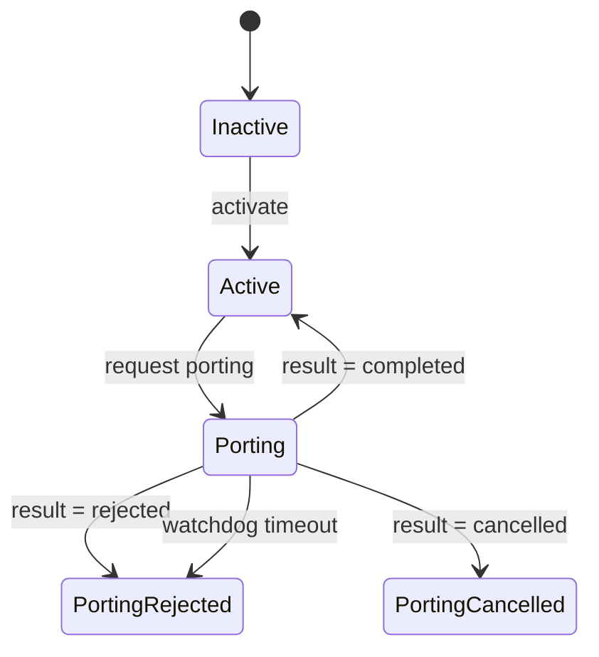
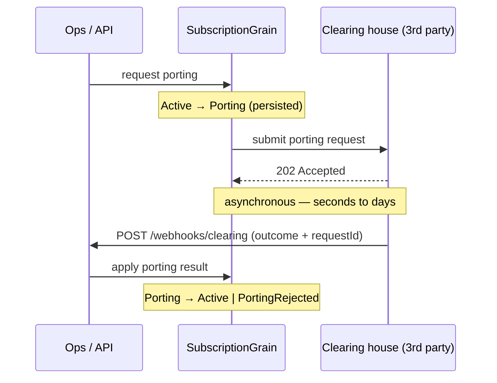

# Parte 1 — Construir el flujo de portabilidad numérica con grains de Orleans

*Parte 1 de una serie que reconstruye un backend de suscripciones tipo telco sobre [Microsoft Orleans](https://github.com/dotnet/orleans). Empieza por la [introducción](00-porting-two-architectures.es.md), que lo compara con el enfoque clásico de cola + repositorio y sopesa cuándo gana cada uno. Este artículo construye la versión de Orleans de punta a punta — y puedes ejecutarla. Código en el repo [TelcoLab](https://github.com/aminch18/TelcoLab).*

---

En la introducción pusimos dos arquitecturas lado a lado y llegamos al veredicto honesto: para portabilidad, el modelo de actores te da corrección de concurrencia por-entidad y un ciclo de vida cohesivo, no un mandato de migración. Ahora construyámoslo de verdad — el grain, el tercero, el webhook, y las partes que lo hacen *correcto* y no solo una demo: la correlación petición/resultado y un timeout.

Recordatorio del flujo: pides conservar tu número, tu operador reenvía la petición a un clearing house, y el resultado — **completado** o **rechazado** — vuelve como webhook segundos o días después. Asíncrono, con tercero, eventualmente consistente.

## Qué es un grain

Una suscripción tiene una identidad estable (su MSISDN), posee un trozo de estado, y reacciona a eventos a lo largo del tiempo — la definición de un actor. Orleans te da **actores virtuales**, llamados *grains*. Un grain:

- se direcciona por una clave que tú eliges (aquí, el número de teléfono),
- es de un solo hilo — nunca hay locks dentro de un grain,
- es *virtual*: siempre "existe"; Orleans lo activa bajo demanda y te persiste su estado,
- vive en un **clúster de silos**, así que los grains se distribuyen entre máquinas sin que shardees nada.

El cuarteto "fila + cola + worker + scheduler" del diseño clásico colapsa en un objeto que tiene identidad, estado y comportamiento juntos.

## El grain

El contrato del grain es su ciclo de vida, con clave = número de teléfono:

```csharp
public interface ISubscriptionGrain : IGrainWithStringKey
{
    Task<SubscriptionState> GetStateAsync();
    Task ActivateAsync();

    // Active -> Porting. Envía la petición; el resultado llega después.
    Task RequestPortingAsync(string donorOperator);

    // Porting -> Active | PortingRejected | PortingCancelled, cuando responde el clearing house.
    Task ApplyPortingResultAsync(PortingResult result);
}
```

El ciclo de vida completo que dirige es lo bastante pequeño para verlo de un vistazo:



El estado es un simple record que Orleans serializa y persiste:

```csharp
[GenerateSerializer]
public record SubscriptionState
{
    [Id(0)] public SubscriptionStatus Status { get; set; } = SubscriptionStatus.Inactive;
    [Id(1)] public string? DonorOperator { get; set; }
    [Id(2)] public PortingRejectionReason? LastRejectionReason { get; set; }
    // La petición en vuelo, usada para correlacionar el webhook que la resuelve.
    [Id(3)] public Guid? PendingPortingRequestId { get; set; }
    [Id(4)] public int PortingAttempts { get; set; }
}
```

## Pedir un port

Pedir un port es una transición guardada. Fíjate en que no hay lock — el grain es de un solo hilo por construcción — y persistimos la intención de portar *antes* de hablar con el tercero:

```csharp
public async Task RequestPortingAsync(string donorOperator)
{
    if (state.State.Status != SubscriptionStatus.Active)
        throw new InvalidOperationException($"No se puede portar desde {state.State.Status}");

    var requestId = Guid.NewGuid();
    state.State.Status = SubscriptionStatus.Porting;
    state.State.DonorOperator = donorOperator;
    state.State.PendingPortingRequestId = requestId;
    state.State.PortingAttempts = 1;
    await state.WriteStateAsync();                        // intención durable, primero

    await this.RegisterOrUpdateReminder("porting-watchdog",
        dueTime: TimeSpan.FromMinutes(1), period: TimeSpan.FromMinutes(1));
    await TrySubmitAsync(requestId, donorOperator);       // el fallo se tolera; el watchdog reintenta
}
```

La suscripción ya está durablemente en `Porting`. Y lo importante: **no esperamos** el resultado. Registramos la intención, armamos una red de seguridad, entregamos la petición al tercero y retornamos.

## El tercero, y el hueco asíncrono

Los resultados de portabilidad reales vuelven como webhook, así que en TelcoLab el tercero es un servicio aparte — un **clearing house** simulado — que responde `202 Accepted` al instante y luego, tras un retardo, *nos* llama de vuelta:

```csharp
// Clearing house: acepta ahora, entrega el resultado después.
app.MapPost("/v1/porting-requests", (PortingRequest request, CallbackScheduler scheduler) =>
{
    var outcome = /* decide: completado o rechazado */;
    scheduler.ScheduleCallback(request.CallbackUrl, /* PortingResultEvent */);
    return Results.Accepted();
});
```

Ese retardo es justo el quid. Representa al operador donante y a la entidad de clearing haciendo lo suyo. Nuestra suscripción permanece en `Porting` todo ese tiempo — de forma consistente, durable, y sin un solo hilo aparcado esperando.

La ida y vuelta completa, de punta a punta:



## Cerrando el círculo: webhook, anticorrupción y dos guardas

Cuando por fin llega el resultado, el borde de nuestra API lo recibe, autentica al emisor y lo enruta directo al grain correcto por MSISDN. Antes de que toque el grain, traducimos el contrato de cable del tercero a *nuestro* vocabulario de dominio — una pequeña [capa anticorrupción](https://learn.microsoft.com/azure/architecture/patterns/anti-corruption-layer). Cada endpoint es un record autocontenido — una vertical slice — que [MinApiLib](https://github.com/fernandoescolar/MinApiLib) descubre automáticamente:

```csharp
public record ClearingWebhook() : Post("/webhooks/clearing")
{
    public async Task<IResult> HandleAsync(
        PortingResultEvent evt, HttpRequest request, IConfiguration config, IClusterClient cluster)
    {
        if (request.Headers["X-Webhook-Secret"] != config["TelcoLab:WebhookSecret"])
            return Results.Unauthorized();       // producción verificaría un HMAC sobre el body

        var result = new PortingResult
        {
            RequestId  = evt.RequestId,
            Succeeded  = evt.Outcome == PortingOutcome.Completed,
            Cancelled  = evt.Outcome == PortingOutcome.Cancelled,
            RejectionReason = evt.Reason is null ? null : MapReason(evt.Reason.Value)
        };

        await cluster.GetGrain<ISubscriptionGrain>(evt.Msisdn).ApplyPortingResultAsync(result);
        return Results.Ok();
    }
}
```

El grain lo aplica tras dos guardas:

```csharp
public async Task ApplyPortingResultAsync(PortingResult result)
{
    if (state.State.Status != SubscriptionStatus.Porting) return;        // no está portando — ignora
    if (result.RequestId != state.State.PendingPortingRequestId) return; // obsoleto/duplicado — ignora

    state.State.Status = result switch
    {
        { Succeeded: true } => SubscriptionStatus.Active,
        { Cancelled: true } => SubscriptionStatus.PortingCancelled,
        _                   => SubscriptionStatus.PortingRejected
    };
    state.State.LastRejectionReason = result.Succeeded ? null : result.RejectionReason;
    state.State.PendingPortingRequestId = null;
    await state.WriteStateAsync();
    await StopWatchdogAsync();
}
```

La primera guarda maneja el orden (un resultado para una suscripción que no está portando). La segunda maneja la correlación (un webhook obsoleto de un intento *anterior* lleva un `RequestId` distinto). En el diseño clásico esos dos `if` son donde ibas a buscar locks de base de datos y tablas de deduplicación; aquí son dos líneas, y como el grain es de un solo hilo la carrera contra la que protegen ni siquiera puede ocurrir.

## ¿Y si el webhook no llega nunca?

La pregunta obvia ante "el grain simplemente se queda en `Porting`" es: *¿para siempre?* No. Pedir el port registró un **reminder** — un timer durable y a nivel de clúster que sobrevive a reinicios del silo, así que un port en vuelo durante horas o días acaba resolviéndose igual:

```csharp
public async Task ReceiveReminder(string name, TickStatus status)
{
    if (state.State.Status != SubscriptionStatus.Porting) { await StopWatchdogAsync(); return; }

    if (state.State.PortingAttempts >= 3)                        // se rinde
    {
        state.State.Status = SubscriptionStatus.PortingRejected;
        state.State.LastRejectionReason = PortingRejectionReason.TimedOut;
        state.State.PendingPortingRequestId = null;
        await state.WriteStateAsync();
        await StopWatchdogAsync();
        return;
    }

    state.State.PortingAttempts++;                               // si no, reenvía
    await state.WriteStateAsync();
    await TrySubmitAsync(state.State.PendingPortingRequestId!.Value, state.State.DonorOperator!);
}
```

Reintenta el envío (el clearing house deduplica por el request id, así que reintentar es seguro), y tras unos cuantos intentos sin respuesta falla el port a `PortingRejected` con razón `TimedOut`. Esto es también por qué escribir `Porting` *antes* de la llamada saliente es correcto: la intención es durable, así que un envío que falla simplemente se reintenta, nunca se pierde. Es el mismo trabajo que hace un *mensaje de timeout* programado en el mundo clásico — solo que vive en el grain, direccionado exactamente a esta suscripción.

## Cableándolo

El proyecto `TelcoLab.Api` co-aloja el silo de Orleans y la API web. La API es el borde — webhooks entrantes y controles de demo, cada uno una vertical slice bajo `Features/`; el silo es el runtime distribuido de actores:

```csharp
var builder = WebApplication.CreateBuilder(args);

builder.Host.UseOrleans(silo =>
{
    silo.UseLocalhostClustering();
    silo.AddMemoryGrainStorage("subscriptionStore");  // estado del grain
    silo.UseInMemoryReminderService();                // el watchdog
});

// El puerto saliente del grain hacia el tercero, como HttpClient tipado.
builder.Services.AddHttpClient<IPortingClient, HttpPortingClient>(c =>
    c.BaseAddress = new Uri(builder.Configuration["TelcoLab:ClearingHouseUrl"]!));

var app = builder.Build();
app.MapEndpoints();   // MinApiLib descubre cada record de endpoint
app.Run();
```

`UseLocalhostClustering` y el almacenamiento en memoria lo mantienen ejecutable en una máquina; cambiar a un provider de clustering real y a storage/reminders durables es un cambio de configuración, no un rediseño — eso es la [Parte 3](03-clustering-and-storage.es.md).

## Verlo en marcha

Dos números — uno que porta limpio y otro que el clearing house rechaza (en la demo, cualquier número acabado en `99`):

```
=== CASO A — +34600000011 ===
1) activado                           -> Active
2) port solicitado                    -> Porting   (pendingPortingRequestId puesto)
... los webhooks son asíncronos; esperando 5s ...
   final                              -> Active     (port completado)

=== CASO B — +34600000099 ===
1) activado + port solicitado         -> Porting
... esperando 5s ...
   final                              -> PortingRejected   (razón: NumberNotPortable)
```

Entre el paso 2 y la línea final, nada bloqueaba. Los grains simplemente *estaban* en `Porting`, y pasaron a otra cosa cuando la realidad les alcanzó. `demo.sh` en el repo dirige exactamente esto.

## Qué viene

Ahora mismo el borde del webhook llama al grain directamente. Funciona, pero acopla el borde al grain y nos da un único consumidor. En la **Parte 2** reemplazamos esa llamada directa por **Orleans Streams**: el borde publica un resultado de portabilidad, el grain se suscribe, y añadir un segundo consumidor — por ejemplo, una traza de auditoría — no cuesta nada en el lado del productor. Todo el código ejecutable está en el [repositorio TelcoLab](https://github.com/aminch18/TelcoLab).
