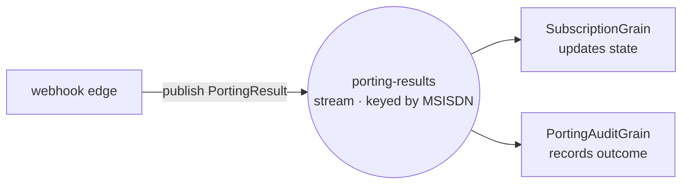

# Part 2 — From a direct call to Orleans Streams

*Part 2 of a series rebuilding a telco-style subscription backend on [Microsoft Orleans](https://github.com/dotnet/orleans). See the [introduction](00-porting-two-architectures.en.md) for the classic-vs-actors comparison and [Part 1](01-porting-with-orleans.en.md) for the grain that this post evolves. Code in the [TelcoLab](https://github.com/aminch18/TelcoLab) repo.*

---

In Part 1, when the porting webhook arrived, the API edge called the grain directly:

```csharp
await cluster.GetGrain<ISubscriptionGrain>(evt.Msisdn).ApplyPortingResultAsync(result);
```

That works, and for a single consumer it's the right amount of machinery. But it quietly bakes in two assumptions: the edge knows exactly *which* grain cares about a porting result, and *only one* grain does. The first porting outcome you need to also audit, bill, notify, or feed into analytics breaks both assumptions — and now the edge grows a second call, then a third, coupling the webhook handler to every downstream concern.

This is the same coupling the classic architecture avoids with a message bus. Orleans has its own answer: **Streams**.

## The idea

A stream is a named, keyed channel inside the cluster. A publisher pushes events to it without knowing who listens; consumers subscribe and react. Instead of the edge calling a specific grain, it **publishes a porting result** to a stream keyed by the MSISDN, and any grain that cares subscribes.



The edge went from *"apply this result to this subscription"* to *"a porting result happened"* — a fact, broadcast. Who reacts is no longer its problem.

## Publishing from the edge

The webhook handler stops calling the grain and publishes instead:

```csharp
var stream = cluster.GetStreamProvider(StreamConstants.ProviderName)
    .GetStream<PortingResult>(StreamId.Create(StreamConstants.PortingResults, evt.Msisdn));

await stream.OnNextAsync(result);   // fire the fact; the edge is done
```

Note the stream is keyed by the MSISDN (`StreamId.Create(namespace, msisdn)`). That keying is what lets each subscription have its own logical channel while sharing one provider.

## Subscribing from the grain

The subscription grain declares an **implicit subscription**: for any stream in the `porting-results` namespace, Orleans wires up the grain whose key matches the stream's key — activating it on demand if needed.

```csharp
[ImplicitStreamSubscription(StreamConstants.PortingResults)]
public class SubscriptionGrain : Grain, ISubscriptionGrain, IRemindable
{
    public override async Task OnActivateAsync(CancellationToken ct)
    {
        var stream = this.GetStreamProvider(StreamConstants.ProviderName)
            .GetStream<PortingResult>(StreamId.Create(StreamConstants.PortingResults, this.GetPrimaryKeyString()));
        await stream.SubscribeAsync((result, _) => ApplyPortingResultAsync(result));
        await base.OnActivateAsync(ct);
    }
    // ApplyPortingResultAsync is unchanged from Part 1 — same two guards, same transition.
}
```

Two things worth noticing. First, `ApplyPortingResultAsync` didn't change at all — the guards and the state machine from Part 1 are exactly the same; only *how the call arrives* changed. Second, the implicit subscription means a subscription that had been deactivated (idle for days, waiting on a slow port) is **reactivated automatically** when its result finally streams in. The webhook doesn't need to know whether the grain is in memory.

## The payoff: a second consumer, for free

Here's the part a direct call can't do. We add an audit trail — a separate grain that also subscribes to the same stream — and we change *nothing* on the publisher:

```csharp
[ImplicitStreamSubscription(StreamConstants.PortingResults)]
public class PortingAuditGrain : Grain, IPortingAuditGrain
{
    public override async Task OnActivateAsync(CancellationToken ct)
    {
        var stream = this.GetStreamProvider(StreamConstants.ProviderName)
            .GetStream<PortingResult>(StreamId.Create(StreamConstants.PortingResults, this.GetPrimaryKeyString()));
        await stream.SubscribeAsync(OnResultAsync);
        await base.OnActivateAsync(ct);
    }

    private async Task OnResultAsync(PortingResult result, StreamSequenceToken? _)
    {
        audit.State = audit.State with { ResolvedCount = audit.State.ResolvedCount + 1, LastOutcome = Describe(result) };
        await audit.WriteStateAsync();
    }
}
```

Run a port through and both grains react to the one published event:

```
subscription  -> { "status": Active }
audit         -> { "resolvedCount": 1, "lastOutcome": "Completed" }
```

The webhook handler has no reference to `PortingAuditGrain`. It never will. Billing, notifications, analytics — each is a new subscriber, none of them a change to the edge. That is the decoupling a message bus gives you in the classic world, but here it's in-cluster, typed, and keyed straight to the entity.

## Wiring the provider

Streams need a provider. For the demo it's in-memory, with a grain-storage-backed pub/sub registry:

```csharp
silo.AddMemoryStreams(StreamConstants.ProviderName);
silo.AddMemoryGrainStorage("PubSubStore");
```

`AddMemoryStreams` is the honest demo choice: fast, zero-dependency, and lost on restart. A production silo swaps in a **persistent** provider — Azure Event Hubs or Azure Queue streams — so published events survive and can be replayed. As with clustering and storage, that's a configuration change, not a redesign.

## What you gained, and what it cost

Compared with the direct call of Part 1:

- **Decoupling.** The edge publishes a fact; consumers come and go without touching it.
- **Fan-out.** N consumers per event, each independent, each individually addressable and stateful.
- **Automatic reactivation.** An idle subscription wakes up when its result arrives.

The cost is real too, and worth saying: a stream provider is one more moving part, in-memory streams lose events on restart (so production means a persistent provider), and delivery is now asynchronous — the edge returns `202` before the grain has applied anything, so you trade a synchronous confirmation for decoupling. For a fan-out workflow that's the right trade; for a strict single-consumer call, Part 1's direct invocation was simpler and you shouldn't reach for streams just because they exist.

## What's next

We now have a grain lifecycle, a third party, correlation, timeouts, and streamed fan-out — all on a single localhost silo. **Part 3** takes the last step that makes it a real distributed system: a **multi-silo cluster** with a real clustering provider, where grains are placed across nodes and the whole thing keeps working when one goes down. The runnable code is in the [TelcoLab repository](https://github.com/aminch18/TelcoLab).
