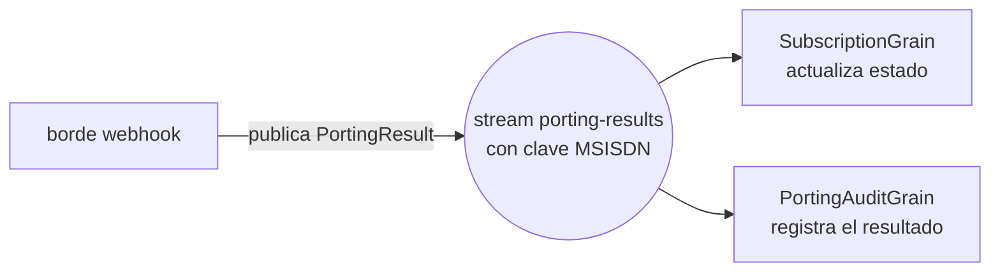

# Parte 2 — De una llamada directa a Orleans Streams

*Parte 2 de una serie que reconstruye un backend de suscripciones tipo telco sobre [Microsoft Orleans](https://github.com/dotnet/orleans). Mira la [introducción](00-porting-two-architectures.es.md) para la comparación clásico-vs-actores y la [Parte 1](01-porting-with-orleans.es.md) para el grain que este artículo evoluciona. Código en el repo [TelcoLab](https://github.com/aminch18/TelcoLab).*

---

En la Parte 1, cuando llegaba el webhook de portabilidad, el borde de la API llamaba al grain directamente:

```csharp
await cluster.GetGrain<ISubscriptionGrain>(evt.Msisdn).ApplyPortingResultAsync(result);
```

Funciona, y para un único consumidor es la cantidad justa de maquinaria. Pero fija en silencio dos supuestos: el borde sabe *exactamente qué* grain le importa un resultado de portabilidad, y *solo uno* lo hace. El primer resultado de portabilidad que necesites además auditar, facturar, notificar o meter en analítica rompe ambos supuestos — y ahora el borde crece una segunda llamada, luego una tercera, acoplando el handler del webhook a cada preocupación de aguas abajo.

Es el mismo acoplamiento que la arquitectura clásica evita con un bus de mensajes. Orleans tiene su propia respuesta: **Streams**.

## La idea

Un stream es un canal con nombre y clave dentro del clúster. Un productor le empuja eventos sin saber quién escucha; los consumidores se suscriben y reaccionan. En vez de que el borde llame a un grain concreto, **publica un resultado de portabilidad** a un stream con clave el MSISDN, y cualquier grain al que le importe se suscribe.



El borde pasó de *"aplica este resultado a esta suscripción"* a *"ha ocurrido un resultado de portabilidad"* — un hecho, difundido. Quién reacciona ya no es su problema.

## Publicar desde el borde

El handler del webhook deja de llamar al grain y en su lugar publica:

```csharp
var stream = cluster.GetStreamProvider(StreamConstants.ProviderName)
    .GetStream<PortingResult>(StreamId.Create(StreamConstants.PortingResults, evt.Msisdn));

await stream.OnNextAsync(result);   // lanza el hecho; el borde ha terminado
```

Fíjate en que el stream tiene clave el MSISDN (`StreamId.Create(namespace, msisdn)`). Esa clave es lo que permite que cada suscripción tenga su propio canal lógico compartiendo un único provider.

## Suscribirse desde el grain

El grain de suscripción declara una **suscripción implícita**: para cualquier stream en el namespace `porting-results`, Orleans conecta el grain cuya clave coincide con la del stream — activándolo bajo demanda si hace falta.

```csharp
[ImplicitStreamSubscription(StreamConstants.PortingResults)]
public class SubscriptionGrain : Grain, ISubscriptionGrain, IRemindable
{
    public override async Task OnActivateAsync(CancellationToken ct)
    {
        var stream = this.GetStreamProvider(StreamConstants.ProviderName)
            .GetStream<PortingResult>(StreamId.Create(StreamConstants.PortingResults, this.GetPrimaryKeyString()));
        await stream.SubscribeAsync((result, _) => ApplyPortingResultAsync(result));
        await base.OnActivateAsync(ct);
    }
    // ApplyPortingResultAsync no cambia respecto a la Parte 1 — las mismas dos guardas, la misma transición.
}
```

Dos cosas que merece la pena notar. Primero, `ApplyPortingResultAsync` no cambió nada — las guardas y la máquina de estados de la Parte 1 son exactamente las mismas; solo cambió *cómo llega la llamada*. Segundo, la suscripción implícita significa que una suscripción que estaba desactivada (inactiva durante días, esperando un port lento) se **reactiva automáticamente** cuando su resultado por fin llega por el stream. El webhook no necesita saber si el grain está en memoria.

## El premio: un segundo consumidor, gratis

Aquí está lo que una llamada directa no puede hacer. Añadimos una traza de auditoría — un grain aparte que también se suscribe al mismo stream — y **no cambiamos nada** en el productor:

```csharp
[ImplicitStreamSubscription(StreamConstants.PortingResults)]
public class PortingAuditGrain : Grain, IPortingAuditGrain
{
    public override async Task OnActivateAsync(CancellationToken ct)
    {
        var stream = this.GetStreamProvider(StreamConstants.ProviderName)
            .GetStream<PortingResult>(StreamId.Create(StreamConstants.PortingResults, this.GetPrimaryKeyString()));
        await stream.SubscribeAsync(OnResultAsync);
        await base.OnActivateAsync(ct);
    }

    private async Task OnResultAsync(PortingResult result, StreamSequenceToken? _)
    {
        audit.State = audit.State with { ResolvedCount = audit.State.ResolvedCount + 1, LastOutcome = Describe(result) };
        await audit.WriteStateAsync();
    }
}
```

Pasa un port y ambos grains reaccionan al único evento publicado:

```
subscription  -> { "status": Active }
audit         -> { "resolvedCount": 1, "lastOutcome": "Completed" }
```

El handler del webhook no tiene ninguna referencia a `PortingAuditGrain`. Nunca la tendrá. Facturación, notificaciones, analítica — cada una es un nuevo suscriptor, ninguna un cambio en el borde. Eso es el desacoplamiento que te da un bus de mensajes en el mundo clásico, pero aquí es dentro del clúster, tipado, y con clave directa a la entidad.

## Cableando el provider

Los streams necesitan un provider. Para la demo es en memoria, con un registro pub/sub respaldado por grain-storage:

```csharp
silo.AddMemoryStreams(StreamConstants.ProviderName);
silo.AddMemoryGrainStorage("PubSubStore");
```

`AddMemoryStreams` es la elección honesta de demo: rápido, sin dependencias, y se pierde al reiniciar. Un silo de producción cambia a un provider **persistente** — Azure Event Hubs o Azure Queue streams — para que los eventos publicados sobrevivan y puedan reproducirse. Como con el clustering y el storage, es un cambio de configuración, no un rediseño.

## Qué ganaste, y qué costó

Comparado con la llamada directa de la Parte 1:

- **Desacoplamiento.** El borde publica un hecho; los consumidores van y vienen sin tocarlo.
- **Fan-out.** N consumidores por evento, cada uno independiente, cada uno direccionable individualmente y con estado.
- **Reactivación automática.** Una suscripción inactiva despierta cuando llega su resultado.

El coste también es real, y conviene decirlo: un stream provider es una pieza más, los streams en memoria pierden eventos al reiniciar (así que producción implica un provider persistente), y la entrega ahora es asíncrona — el borde devuelve `202` antes de que el grain haya aplicado nada, así que cambias una confirmación síncrona por desacoplamiento. Para un flujo con fan-out ese es el trueque correcto; para una llamada estricta de un solo consumidor, la invocación directa de la Parte 1 era más simple y no deberías tirar de streams solo porque existen.

## Qué viene

Ahora tenemos un ciclo de vida de grain, un tercero, correlación, timeouts y fan-out por stream — todo en un único silo localhost. La **Parte 3** da el último paso que lo convierte en un sistema distribuido de verdad: un **clúster multi-silo** con un provider de clustering real, donde los grains se reparten entre nodos y todo sigue funcionando cuando uno cae. El código ejecutable está en el [repositorio TelcoLab](https://github.com/aminch18/TelcoLab).
