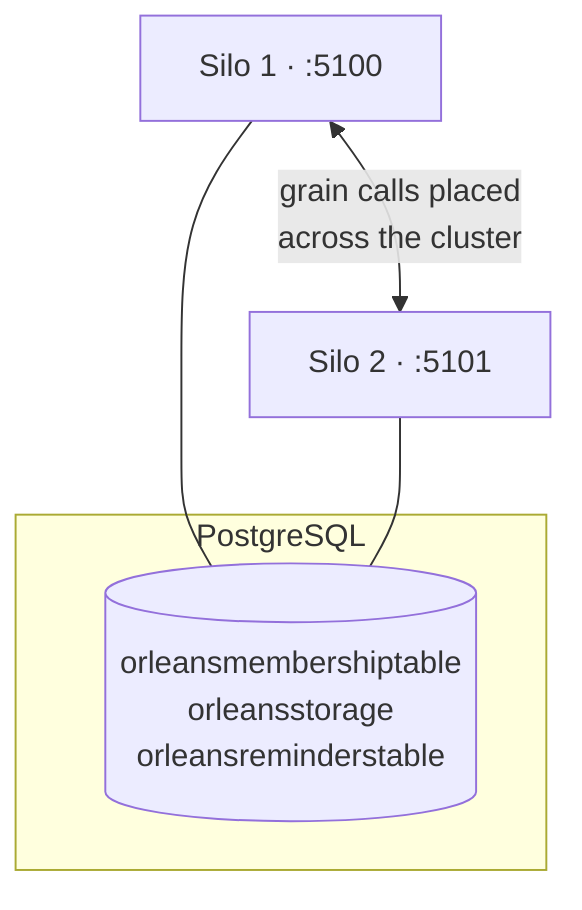

# Part 3 — From one silo to a real cluster on Postgres

*Part 3 of a series rebuilding a telco-style subscription backend on [Microsoft Orleans](https://github.com/dotnet/orleans). See the [introduction](00-porting-two-architectures.en.md), [Part 1](01-porting-with-orleans.en.md) (grains) and [Part 2](02-porting-with-streams.en.md) (streams). Code in the [TelcoLab](https://github.com/aminch18/TelcoLab) repo.*

---

Every previous post ended with the same disclaimer: *it runs on a single localhost silo with in-memory storage; making it production-shaped is a configuration change, not a redesign.* This post cashes that cheque. We move grain state, reminders, and cluster membership onto **PostgreSQL**, and we run **two silos as a real cluster** — without touching a single line of the grain code.

## What "in-memory" was hiding

Until now the silo was configured like this:

```csharp
silo.UseLocalhostClustering();
silo.AddMemoryGrainStorage("subscriptionStore");
silo.UseInMemoryReminderService();
```

Three things live in memory there, and all three are lost on restart:

- **Grain state** — a completed port reverts to nothing when the process dies.
- **Reminders** — the porting watchdog forgets what it was watching.
- **Cluster membership** — `UseLocalhostClustering` is a single-node convenience; there is no shared place for silos to find each other.

That last one is the real blocker: **you cannot build a multi-silo cluster on localhost clustering.** Silos form a cluster by reading and writing a shared membership table. No shared store, no cluster.

## The swap

Orleans persists all three concerns through **ADO.NET providers**. Point them at Postgres and the picture becomes:

```csharp
silo.UseAdoNetClustering(o => { o.Invariant = "Npgsql"; o.ConnectionString = cs; });
silo.AddAdoNetGrainStorage("subscriptionStore", o => { o.Invariant = "Npgsql"; o.ConnectionString = cs; });
silo.UseAdoNetReminderService(o => { o.Invariant = "Npgsql"; o.ConnectionString = cs; });
```

In TelcoLab this is behind one method, `ConfigureStorage`, which chooses providers by whether a connection string is present — so the demo and the unit tests still run with zero infrastructure, and Postgres switches on when you want it:

```csharp
builder.Host.UseOrleans(silo => silo.ConfigureStorage(builder.Configuration));
```

The grain — its state machine, its guards, its watchdog, its stream subscription — is **byte-for-byte identical**. This is the whole promise of the previous three posts, made concrete: the actor code is about the domain; where its state lives is deployment configuration.

## One honest caveat: the schema is yours to create

ADO.NET providers do **not** create their tables automatically. Orleans ships PostgreSQL setup scripts (clustering, persistence, reminders); you run them once. TelcoLab automates that with docker-compose, mounting the scripts into Postgres's init directory so the schema exists before any silo connects:

```yaml
volumes:
  - ./db:/docker-entrypoint-initdb.d:ro
```

After `docker compose up`, the database has exactly the tables Orleans expects:

```
orleansmembershiptable          -- who is in the cluster
orleansmembershipversiontable
orleansquery                    -- the provider's SQL, by key
orleansreminderstable           -- durable reminders
orleansstorage                  -- grain state
```

(One gotcha worth knowing: a runtime can require a membership query the shipped script doesn't define — for us, a defunct-entry cleanup query — and refuse to start until it's present. The fix is a one-row insert into `orleansquery`. Version-matching the setup scripts to the runtime is a real, if boring, part of running ADO.NET Orleans.)

## Proof it's durable

Start one silo against Postgres, complete a port, then **kill the process and start a fresh one**:

```
before restart:  { "status": "Active", "portingAttempts": 1 }
        (kill the silo, start a new one)
after restart:   { "status": "Active", "portingAttempts": 1 }
```

The second silo never saw the port happen. It read the subscription's state from `orleansstorage` on first access. With in-memory storage this returns `Inactive` — the whole history gone.

## Proof it's a cluster

Now run **two** silos at once, each on its own ports, both pointed at the same database:



They find each other through the membership table and form one cluster:

```
 siloname   | port  | status
------------+-------+--------
 Silo_2eece | 11111 |   3   (Active)
 Silo_563fb | 11112 |   3   (Active)
```

And a grain is a *single* thing no matter which silo you talk to. Activate a subscription through silo 1, read it through silo 2, and it's the same actor:

```
POST :5100/subscriptions/+34600000022/activate   -> { "status": "Active" }
GET  :5101/subscriptions/+34600000022            -> { "status": "Active" }   # same grain, other silo
```

Orleans placed the grain on one silo and routed silo 2's call to it. You never chose a node, never sharded a key, never wrote a cache-invalidation line. That is what the virtual actor runtime does that a bag of stateless services plus a database does not: it makes "one subscription" a single, addressable, in-memory-consistent object across the whole cluster.

## What you'd still change for production

Honesty, as ever. This is a real cluster, but a production deployment goes further:

- **Streams** are still the in-memory provider here; a durable deployment uses a persistent one (Azure Event Hubs / Queue streams) so published events survive a silo loss.
- **Clustering** on Postgres is fine for many workloads; at large scale teams often use a purpose-built membership store (Azure Table, Consul) — again, a provider swap.
- **Connection resilience, pooling, migrations, secrets** for the database are now yours to operate — the flip side of "it's just a database."

But the architectural claim holds: from one laptop process to a durable, multi-node cluster, the grain code did not change. Only its hosting did.

## The series, end to end

We started by comparing the actor model against the classic queue + repository approach, built the porting workflow as a grain, decoupled its results with streams, and have now made it durable and clustered. What began as "a subscription is an actor" is now a small but genuine distributed system. The full, runnable code — `docker compose up`, two `dotnet run`s, and `demo.sh` — is in the [TelcoLab repository](https://github.com/aminch18/TelcoLab).
