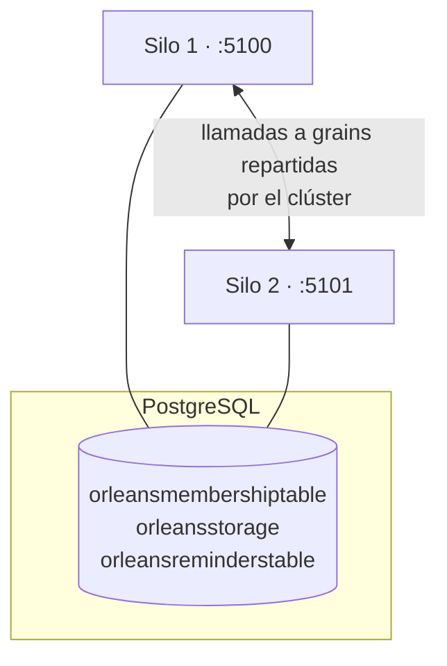

# Parte 3 — De un silo a un clúster real sobre Postgres

*Parte 3 de una serie que reconstruye un backend de suscripciones tipo telco sobre [Microsoft Orleans](https://github.com/dotnet/orleans). Mira la [introducción](00-porting-two-architectures.es.md), la [Parte 1](01-porting-with-orleans.es.md) (grains) y la [Parte 2](02-porting-with-streams.es.md) (streams). Código en el repo [TelcoLab](https://github.com/aminch18/TelcoLab).*

---

Cada artículo anterior terminaba con el mismo aviso: *corre en un único silo localhost con almacenamiento en memoria; hacerlo apto para producción es un cambio de configuración, no un rediseño.* Este artículo cobra ese cheque. Movemos el estado de los grains, los reminders y la membresía del clúster a **PostgreSQL**, y corremos **dos silos como un clúster real** — sin tocar una sola línea del código del grain.

## Qué escondía el "in-memory"

Hasta ahora el silo se configuraba así:

```csharp
silo.UseLocalhostClustering();
silo.AddMemoryGrainStorage("subscriptionStore");
silo.UseInMemoryReminderService();
```

Tres cosas viven ahí en memoria, y las tres se pierden al reiniciar:

- **Estado del grain** — un port completado vuelve a nada cuando muere el proceso.
- **Reminders** — el watchdog de portabilidad olvida qué estaba vigilando.
- **Membresía del clúster** — `UseLocalhostClustering` es una comodidad de un solo nodo; no hay un sitio compartido donde los silos se encuentren.

Ese último es el bloqueo real: **no puedes montar un clúster multi-silo sobre localhost clustering.** Los silos forman clúster leyendo y escribiendo una tabla de membresía compartida. Sin store compartido, no hay clúster.

## El swap

Orleans persiste las tres cosas mediante **proveedores ADO.NET**. Apúntalos a Postgres y el cuadro queda:

```csharp
silo.UseAdoNetClustering(o => { o.Invariant = "Npgsql"; o.ConnectionString = cs; });
silo.AddAdoNetGrainStorage("subscriptionStore", o => { o.Invariant = "Npgsql"; o.ConnectionString = cs; });
silo.UseAdoNetReminderService(o => { o.Invariant = "Npgsql"; o.ConnectionString = cs; });
```

En TelcoLab esto vive detrás de un método, `ConfigureStorage`, que elige proveedores según haya o no connection string — así la demo y los tests unitarios siguen corriendo sin infraestructura, y Postgres se activa cuando quieres:

```csharp
builder.Host.UseOrleans(silo => silo.ConfigureStorage(builder.Configuration));
```

El grain — su máquina de estados, sus guardas, su watchdog, su suscripción al stream — es **idéntico byte a byte**. Esta es toda la promesa de los tres artículos anteriores, hecha concreta: el código del actor va del dominio; dónde vive su estado es configuración de despliegue.

## Un matiz honesto: el esquema lo creas tú

Los proveedores ADO.NET **no** crean sus tablas solos. Orleans trae scripts de setup para PostgreSQL (clustering, persistence, reminders); los ejecutas una vez. TelcoLab lo automatiza con docker-compose, montando los scripts en el directorio de init de Postgres para que el esquema exista antes de que ningún silo conecte:

```yaml
volumes:
  - ./db:/docker-entrypoint-initdb.d:ro
```

Tras `docker compose up`, la base de datos tiene exactamente las tablas que Orleans espera:

```
orleansmembershiptable          -- quién está en el clúster
orleansmembershipversiontable
orleansquery                    -- el SQL del proveedor, por clave
orleansreminderstable           -- reminders durables
orleansstorage                  -- estado de los grains
```

(Un detalle que conviene saber: un runtime puede requerir una query de membresía que el script distribuido no define — en nuestro caso, una de limpieza de entradas difuntas — y negarse a arrancar hasta que esté. El fix es un insert de una fila en `orleansquery`. Cuadrar los scripts de setup con la versión del runtime es una parte real, aunque aburrida, de operar Orleans con ADO.NET.)

## Prueba de que es durable

Arranca un silo contra Postgres, completa un port, y luego **mata el proceso y arranca uno nuevo**:

```
antes del reinicio:  { "status": "Active", "portingAttempts": 1 }
        (mata el silo, arranca otro)
tras el reinicio:    { "status": "Active", "portingAttempts": 1 }
```

El segundo silo nunca vio ocurrir el port. Leyó el estado de la suscripción de `orleansstorage` en el primer acceso. Con almacenamiento en memoria esto devuelve `Inactive` — toda la historia perdida.

## Prueba de que es un clúster

Ahora corre **dos** silos a la vez, cada uno en sus puertos, ambos apuntando a la misma base de datos:



Se encuentran a través de la tabla de membresía y forman un clúster:

```
 siloname   | port  | status
------------+-------+--------
 Silo_2eece | 11111 |   3   (Active)
 Silo_563fb | 11112 |   3   (Active)
```

Y un grain es una *única* cosa da igual con qué silo hables. Activa una suscripción por el silo 1, léela por el silo 2, y es el mismo actor:

```
POST :5100/subscriptions/+34600000022/activate   -> { "status": "Active" }
GET  :5101/subscriptions/+34600000022            -> { "status": "Active" }   # mismo grain, otro silo
```

Orleans colocó el grain en un silo y enrutó la llamada del silo 2 hasta él. Nunca elegiste un nodo, nunca shardeaste una clave, nunca escribiste una línea de invalidación de caché. Eso es lo que hace el runtime de actores virtuales que un montón de servicios stateless más una base de datos no hace: convierte "una suscripción" en un objeto único, direccionable y consistente en memoria a lo largo de todo el clúster.

## Qué cambiarías aún para producción

Honestidad, como siempre. Esto es un clúster real, pero un despliegue de producción va más allá:

- Los **streams** aquí siguen siendo el proveedor en memoria; un despliegue durable usa uno persistente (Azure Event Hubs / Queue streams) para que los eventos publicados sobrevivan a la pérdida de un silo.
- El **clustering** sobre Postgres va bien para muchas cargas; a gran escala los equipos suelen usar un store de membresía dedicado (Azure Table, Consul) — otra vez, un swap de proveedor.
- La **resiliencia de conexión, el pooling, las migraciones y los secretos** de la base de datos ahora son tuyos de operar — la otra cara de "es solo una base de datos".

Pero la afirmación arquitectónica se sostiene: de un proceso en tu portátil a un clúster durable y multi-nodo, el código del grain no cambió. Solo su hosting.

## La serie, de punta a punta

Empezamos comparando el modelo de actores con el enfoque clásico de cola + repositorio, construimos el flujo de portabilidad como un grain, desacoplamos sus resultados con streams, y ahora lo hemos hecho durable y en clúster. Lo que empezó como "una suscripción es un actor" es ya un sistema distribuido pequeño pero real. Todo el código ejecutable — `docker compose up`, dos `dotnet run` y `demo.sh` — está en el [repositorio TelcoLab](https://github.com/aminch18/TelcoLab).
