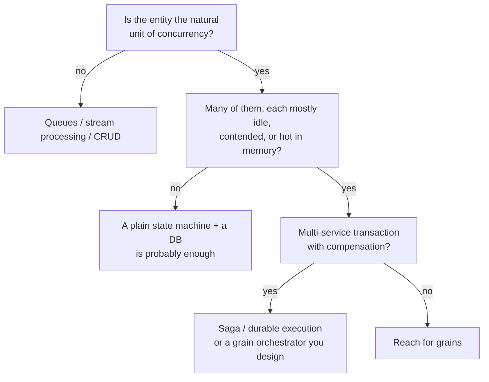

# Part 4 — When *not* to reach for Orleans

*The closing post of a series that rebuilt a telco-style porting workflow on [Microsoft Orleans](https://github.com/dotnet/orleans): the [introduction](00-porting-two-architectures.en.md), [grains](01-porting-with-orleans.en.md), [streams](02-porting-with-streams.en.md), and [clustering on Postgres](03-clustering-and-storage.en.md). Code in the [TelcoLab](https://github.com/aminch18/TelcoLab) repo.*

---

Having spent four posts building something with a tool, the most useful thing I can do is tell you when *not* to use it. A tool you can't argue against is a tool you don't understand. So here is the honest scorecard for the virtual actor model — distilled from doing the porting workflow both the classic way and the Orleans way.

## The one question

Everything reduces to this:

> Is your work **many stateful things, each individually addressable, where the thing is the unit of concurrency**? Or is it **messages flowing between services**, or **sets and batches over data**?

The first is what actors are for. The second is what queues, stream processors, and plain CRUD are for. Number porting sits in the first camp — a subscription is a long-lived, individually-addressable thing that coordinates its own lifecycle — which is why it made a good example. Most of a real backend does not.

## What Orleans does *not* solve

This is where the marketing gets ahead of the truth, so let's be blunt.

- **It doesn't give you a state machine.** We wrote the porting state machine by hand — the statuses, the guards, the transitions. Orleans gave it a durable, single-threaded home; the logic was always ours. You could drop a state-machine library *inside* a grain and they'd be orthogonal.
- **It doesn't replace the saga pattern.** A grain coordinating a long-running process *is* a saga in the conceptual sense — correlated, persistent, with timeouts. What Orleans replaces is the saga *infrastructure*: the message bus, the saga store, the correlation lookup, the optimistic-concurrency dance. The pattern stays; the plumbing goes.
- **It doesn't hand you distributed transactions.** A single-entity workflow is easy; multi-entity coordination with compensation (book flight + hotel, roll back on failure) is still yours to design — with an orchestrator grain, or Orleans Transactions, or a saga framework. Orleans gives you good primitives, not free compensation.

Actors are not a different *model of the problem*. They're a different *place to run it*.

## The one win that's genuinely structural

If you take one thing: the actor model **dissolves a concurrency dilemma you may not know you have.**

In the classic design, resolving a porting result means a consumer loading a row, guarding a transition, and saving. Run one consumer per queue and you're safe but serial — and you've serialized unrelated subscriptions against each other. Run many consumers and two events for the *same* subscription can race, so you reach for optimistic concurrency and retry-on-conflict, sprinkled through every handler.

A grain is single-threaded *per key*. Same-subscription operations never interleave; different subscriptions run fully parallel. You get per-entity safety and cross-entity parallelism at once, and you delete the retry-on-conflict code. Optimistic concurrency doesn't vanish — it survives as an ETag backstop for rare split-brain — but it moves from something you code everywhere to something the runtime handles at the edges. That's not "faster." It's a category of bug made structurally impossible.

## A decision heuristic

And in concrete situations:

| Situation | Lean | Why |
| --- | --- | --- |
| Game session, matchmaking | **Actor** | hot per-session state, low latency |
| IoT device shadows (millions) | **Actor** | activate-on-demand, per-device serialization |
| Shopping cart | **Actor** | per-cart state, hot during the session |
| Account with high contention | **Actor** | serializes per account without locks |
| Order across payment + stock + shipping | **Saga / durable** | multi-party compensation |
| Choreography across many services | **Event bus** | decoupling is the point |
| Billing batch over all accounts | **Classic / SQL** | set-based, not per-entity |
| Long human-approval workflow | **Durable execution** | a linear script of awaits |
| **Number porting** | **Draw** | actor: concurrency + cohesion; classic: cold state, you already have a bus |

## When *not* to use Orleans

Plainly:

- When your system is already happily event-driven on a broker and a database — adding a stateful runtime is a second thing to operate, not a saving.
- When the work is batch or analytical — actors are the wrong shape for "process all rows."
- When you need the broker's visible in-flight work — queue depth, dead-letter, replay — which the actor runtime hides.
- When the team doesn't want to learn the actor model, single-threaded reentrancy, silo operations, and clustering — that learning cost is real and it's paid by everyone.
- When one localhost process would do. Not every workflow needs a cluster.

## Where porting actually landed

A draw that leans classic, if you already own the bus. Porting has cold state touched a few times over days, so the in-memory advantage is marginal, and a real telco backend is already event-driven across contexts — so Orleans would be a second runtime bolted on, not the core.

Which is exactly why it was worth building. It's small enough to hold in your head and it exercises every hard part — asynchrony, a third party, durable intermediate state, timeouts, out-of-order delivery, fan-out, clustering — so the trade-offs become concrete instead of slogans. The lesson was never "use Orleans for porting." It's that the actor model turns per-entity concurrency correctness from careful defensive work into a structural guarantee — and that's worth reaching for exactly when the *entity*, not the message, is the thing you're coordinating.

Everything — four architectures' worth of thinking and one runnable implementation — is in the [TelcoLab repository](https://github.com/aminch18/TelcoLab).
