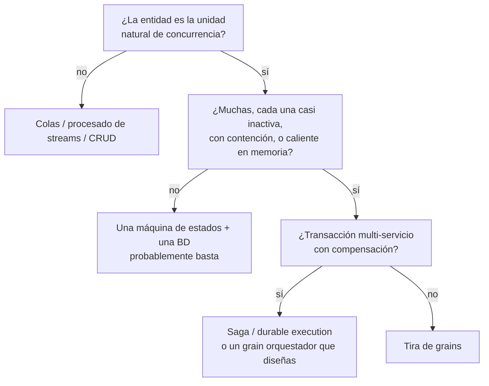

# Parte 4 — Cuándo *no* recurrir a Orleans

*Artículo de cierre de una serie que reconstruyó un flujo de portabilidad tipo telco sobre [Microsoft Orleans](https://github.com/dotnet/orleans): la [introducción](00-porting-two-architectures.es.md), [grains](01-porting-with-orleans.es.md), [streams](02-porting-with-streams.es.md) y [clustering sobre Postgres](03-clustering-and-storage.es.md). Código en el repo [TelcoLab](https://github.com/aminch18/TelcoLab).*

---

Tras cuatro artículos construyendo algo con una herramienta, lo más útil que puedo hacer es decirte cuándo *no* usarla. Una herramienta contra la que no sabes argumentar es una herramienta que no entiendes. Así que aquí va el marcador honesto del modelo de actores virtuales — destilado de haber hecho el flujo de portabilidad tanto a la manera clásica como con Orleans.

## La única pregunta

Todo se reduce a esto:

> ¿Tu trabajo son **muchas cosas stateful, cada una direccionable individualmente, donde la cosa es la unidad de concurrencia**? ¿O son **mensajes fluyendo entre servicios**, o **conjuntos y lotes sobre datos**?

Lo primero es para lo que sirven los actores. Lo segundo es para lo que sirven las colas, los procesadores de streams y el CRUD a secas. La portabilidad numérica cae en el primer campo — una suscripción es una cosa longeva, direccionable individualmente, que coordina su propio ciclo de vida — por eso fue un buen ejemplo. La mayor parte de un backend real no lo es.

## Qué *no* resuelve Orleans

Aquí es donde el marketing se adelanta a la verdad, así que seamos claros.

- **No te da una máquina de estados.** La máquina de estados de portabilidad la escribimos a mano — los estados, las guardas, las transiciones. Orleans le dio un hogar durable y de un solo hilo; la lógica siempre fue nuestra. Podrías meter una librería de máquinas de estados *dentro* de un grain y serían ortogonales.
- **No reemplaza el patrón saga.** Un grain que coordina un proceso largo *es* una saga en el sentido conceptual — correlacionado, persistente, con timeouts. Lo que Orleans reemplaza es la *infraestructura* de la saga: el bus de mensajes, el saga store, la búsqueda de correlación, el baile de la concurrencia optimista. El patrón se queda; la fontanería se va.
- **No te regala transacciones distribuidas.** Un workflow de una sola entidad es fácil; la coordinación multi-entidad con compensación (reservar vuelo + hotel, revertir si falla) sigue siendo tuya de diseñar — con un grain orquestador, o con Orleans Transactions, o con una librería de sagas. Orleans te da buenos primitivos, no compensación gratis.

Los actores no son un *modelo distinto del problema*. Son un *sitio distinto donde ejecutarlo*.

## La única ganancia genuinamente estructural

Si te llevas una cosa: el modelo de actores **disuelve un dilema de concurrencia que quizá no sabes que tienes.**

En el diseño clásico, resolver un resultado de portabilidad es un consumer cargando una fila, guardando una transición y guardando. Corre un consumer por cola y estás seguro pero en serie — y has serializado suscripciones que no tienen que ver entre sí. Corre varios consumers y dos eventos de la *misma* suscripción pueden competir, así que tiras de concurrencia optimista y retry-on-conflict, esparcidos por cada handler.

Un grain es de un solo hilo *por clave*. Las operaciones de la misma suscripción nunca se entrelazan; suscripciones distintas corren totalmente en paralelo. Obtienes seguridad por-entidad y paralelismo entre entidades a la vez, y borras el código de retry-on-conflict. La concurrencia optimista no se evapora — sobrevive como red de seguridad de ETag para el raro split-brain — pero pasa de ser algo que codificas por todas partes a algo que el runtime maneja en los bordes. Eso no es "más rápido". Es una categoría de bug vuelta estructuralmente imposible.

## Un heurístico de decisión

Y en situaciones concretas:

| Situación | Inclínate a | Por qué |
| --- | --- | --- |
| Sesión de juego, matchmaking | **Actor** | estado caliente por sesión, baja latencia |
| Device shadows IoT (millones) | **Actor** | activate-on-demand, serialización por dispositivo |
| Carrito de compra | **Actor** | estado por carrito, caliente en la sesión |
| Cuenta con alta contención | **Actor** | serializa por cuenta sin locks |
| Pedido entre pago + stock + envío | **Saga / durable** | compensación multi-parte |
| Coreografía entre muchos servicios | **Bus de eventos** | el desacoplamiento es el punto |
| Billing batch sobre todas las cuentas | **Clásico / SQL** | set-based, no por-entidad |
| Workflow largo de aprobación humana | **Durable execution** | un guion lineal de awaits |
| **Portabilidad numérica** | **Empate** | actor: concurrencia + cohesión; clásico: estado frío, ya tienes bus |

## Cuándo *no* usar Orleans

Sin rodeos:

- Cuando tu sistema ya es feliz siendo event-driven sobre un broker y una base de datos — añadir un runtime stateful es una segunda cosa que operar, no un ahorro.
- Cuando el trabajo es batch o analítico — los actores son la forma equivocada para "procesa todas las filas".
- Cuando necesitas el trabajo-en-vuelo visible del broker — profundidad de cola, dead-letter, replay — que el runtime de actores esconde.
- Cuando el equipo no quiere aprender el modelo de actores, la reentrancia de un solo hilo, la operación de silos y el clustering — ese coste de aprendizaje es real y lo paga todo el mundo.
- Cuando un solo proceso localhost bastaría. No todo workflow necesita un clúster.

## Dónde cayó realmente el porting

Un empate que se inclina a la clásica, si ya tienes el bus. El porting tiene estado frío que se toca unas pocas veces en días, así que la ventaja de memoria es marginal, y un backend telco real ya es event-driven entre contextos — así que Orleans sería un segundo runtime atornillado, no el núcleo.

Que es justo por lo que valió la pena construirlo. Es lo bastante pequeño para tenerlo en la cabeza y ejercita cada parte difícil — asincronía, un tercero, estado intermedio durable, timeouts, entregas desordenadas, fan-out, clustering — así que los trade-offs se vuelven concretos en vez de eslóganes. La lección nunca fue "usa Orleans para porting". Es que el modelo de actores convierte la corrección de concurrencia por-entidad de trabajo defensivo cuidadoso en una garantía estructural — y eso vale la pena exactamente cuando la *entidad*, no el mensaje, es lo que estás coordinando.

Todo — cuatro arquitecturas de reflexión y una implementación ejecutable — está en el [repositorio TelcoLab](https://github.com/aminch18/TelcoLab).
